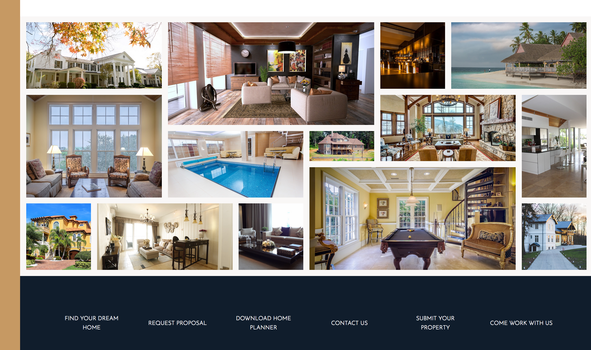

  

## Nexter
An Advanced CSS project focusing on CSS Grid Layout.

## Installation and Setup Instructions
Clone down this repository. You will need `node` and `npm` installed globally on your machine.
##### Installation:

`npm install`  

##### To Start Server:

`npm start`  

## Reflection
This was a project built during the [Udemy Course: Advanced CSS & SASS: Flexbox, Grid, Animations and More!](https://www.udemy.com/advanced-css-and-sass/) Project goals included... 

* CSS Grid Layout
* BEM Methodology
* CSS animations
* Responsive Design
* Font-size rem/em units

This project was solely focused on learning CSS Grid. I really enjoyed learning this new CSS API. You are not restricted to the "typical" 12-grid layout as in the past. It completely changes the way layouts are created in CSS.

Browser development tools are still lacking. Currently, Firefox has the best support for CSS Grid. 
